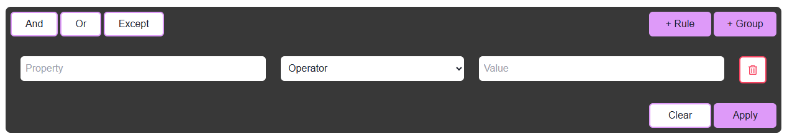
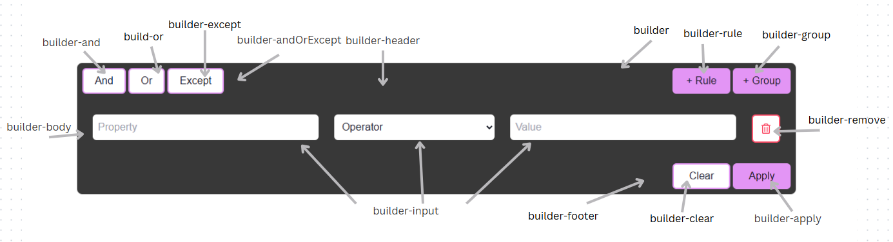

# Overview

The query builder custom component will allow you to retrieve data by building and customizing database queries through a user-friendly interface without having to write raw query code.

## Query builder component



## Datasource

| Name        | Type             | Required | Description                                                               |
| ----------- | ---------------- | -------- | ------------------------------------------------------------------------- |
| Qodlysource | Entity selection | Yes      | Will contain the selection on which the constructed query will be applied |

### Custom Css

Below, is a css class sample containing all the customisable parts of the query builder component:



```css
self .builder {
  background-color: #f0f8ff;
}

/*to customize the whole header css*/
self .builder-header {
  background-color: white;
  padding: 10px;
}

/*to customize the whole section that encaplsulates the 3 buttons on the left css*/
self .builder-andOrExcept {
  background-color: #f0f8ff;
  padding: 5px;
}

/*to customize the And button css*/
self .builder-and {
  border-color: black;
}

/*to customize the Or button css*/
self .builder-or {
  border-color: black;
}

/*to customize the Except button css*/
self .builder-except {
  border-color: black;
}

/*to customize the rule button css*/
self .builder-rule {
  background-color: #f0f8ff;
  border-color: black;
}

/*to customize the group button css*/
self .builder-group {
  background-color: #f0f8ff;
  border-color: black;
}

/*to customize the body containing the rules css*/
self .builder-body {
  background-color: white;
}

/*to customize the property, operator , value input css*/
self .builder-input {
  border-radius: 0px;
  box-shadow: rgba(100, 100, 111, 0.2) 0px 7px 29px 0px;
}

/*to customize the remove button css*/
self .builder-remove {
  box-shadow: rgba(100, 100, 111, 0.2) 0px 7px 29px 0px;
  border-color: #f0f8ff;
}

/*to customize the section containig the clear + apply button css*/
self .builder-footer {
  background-color: white;
  padding: 10px;
}

/*to customize the Clear button css*/
self .builder-clear {
  border-color: black;
}

/*to customize the Apply button css*/
self .builder-apply {
  background-color: #f0f8ff;
}

/*to customize the container of the group operators css*/
self .builder-group-container {
  padding: 5px;
  border: solid 1px blue;
}

/*to customize the group operators*/

self .builder-and-group {
  border-color: black;
  background-color: #ffffff;
}

self .builder-or-group {
  border-color: black;
  background-color: #ffffff;
}
```
